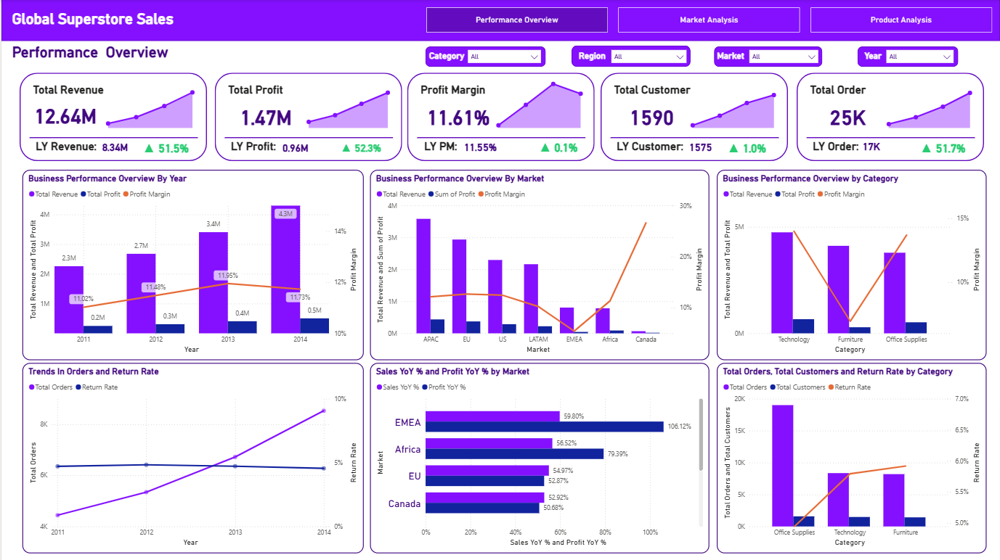
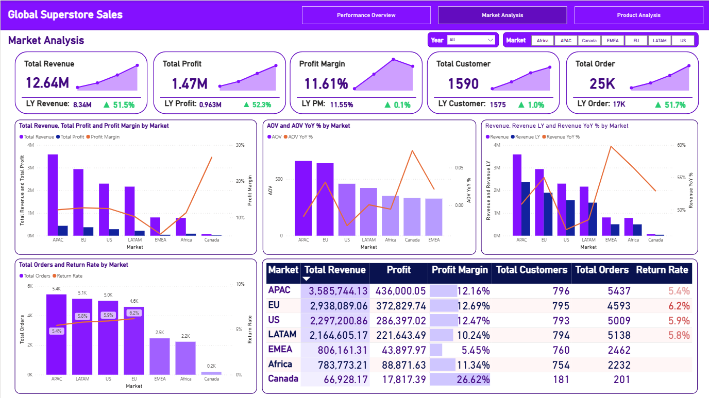

# 📊 Power BI | Global Superstore Sales Performance Dashboard 

  

_Help a Senior Manager understand the overall business performance, compare markets, and identify which products to grow or cut - all in one interactive dashboard._

- 🎯 **Business Question:** What is the overall business performance, how are different markets doing, and which products should the company focus on?
- 🏬 **Domain:** Global Retail / E-commerce 
- 🛠️ **Tools:** Power BI

👤 Author: Bạch Minh Nam

---

## 📑 Table of Contents
1. [📌 Background & Overview](#-background--overview)
2. [📂 Dataset Description & Data Structure](#-dataset-description--data-structure)
3. [🧠 Design Thinking Process](#-design-thinking-process)
4. [📊 Key Findings & Visualizations](#-key-findings--visualizations)
5. [🔎 Final Conclusion & Recommendations](#-final-conclusion--recommendations)

---

## 📌 Background & Overview

### 🎯 Business Problem

Global Superstore is a company that sells products in many markets across different continents. The company is growing fast and wants to expand into more markets to gain market share.

The Senior Manager needs a dashboard to answer 3 main questions:

✔️ **Overall Performance:** How is the business doing right now? Is revenue and profit growing?

✔️ **Market Performance:** Which markets are performing well, and which ones need attention?

✔️ **Product Performance:** Which product categories are profitable, and which ones should be prioritized or cut?

This project uses Power BI to turn raw sales data into a dashboard that helps the Senior Manager make faster, data-driven decisions about where to expand and which products to invest in.

### 👤 Who is this project for?

✔️ Senior Managers & Business Directors - to get a quick, reliable view of company performance

✔️ Sales & Market teams - to compare performance across regions and plan strategy

✔️ Product teams - to identify which categories or products drive (or hurt) profit

---

## 📂 Dataset Description & Data Structure

### 📌 Data Source
- Source: Global Superstore Sales dataset (loaded via Google BigQuery)
- Format: Live connection / Power Query

### 📊 Data Structure & Relationships

#### 1️⃣ Data Structure

The dataset has **3 tables**:

<b>📋Table 1: Orders</b> - Main fact table storing all sales transaction details

  
| Column Name | Description |
|---|---|
| `Order ID` | Unique ID for each order |
| `Order Date` | Date the order was placed |
| `Ship Date` | Date the order was shipped |
| `Ship Mode` | Shipping method |
| `Customer ID` | Unique ID for each customer |
| `Customer Name` | Name of the customer |
| `Segment` | Customer segment |
| `City` | City of the customer |
| `State` | State/Province of the customer |
| `Country` | Country of the customer |
| `Postal Code` | Postal code of the customer's location |
| `Market` | Market region |
| `Region` | Sub-region within a market |
| `Product ID` | Unique ID for each product |
| `Category` | High-level product category |
| `Sub-Category` | More specific product grouping under a category |
| `Product Name` | Name of the product |
| `Sales` | Total sales value of the order line |
| `Quantity` | Number of units ordered |
| `Discount` | Discount rate applied to the order |
| `Profit` | Profit earned from the order |
| `Shipping Cost` | Cost to ship the order |
| `Order Priority` | Priority level of the order |
 

<b>👤 Table 2: People</b> - Stores salesperson and regional assignments

  
| Column Name | Description |
|---|---|
| `Person` | Name of the salesperson |
| `Region` | Region this person is responsible for |
 

<b>↩️ Table 3: Returns</b> - Records product returns by order

  
| Column Name | Description |
|---|---|
| `Order ID` | Order that was returned |
| `Returned` | Yes/No flag indicating if order was returned |
 

#### 2️⃣ Data Relationships

The 3 tables are connected as follows:

- `People` → `Orders`: One person manages many orders (1-to-many, joined on `Region`)
- `Orders` → `Returns`: One order can have one return record (joined on `Order ID`)

  

---

## 🧠 Design Thinking Process

This project followed the Design Thinking framework across 2 main steps: Empathize and Define Point of View

### 1️⃣ Empathize - Understanding the Stakeholder

  

### 2️⃣ Define Point of View - Choosing the Right Angles

  

### **⭐ Northstar Metrics:**

  

---

## 📊 Key Findings & Visualizations  

### 🔍 Dashboard Preview

#### 1️⃣ Page 1 - Performance Overview

  

---

**📈 Key Findings:**

- Revenue grew consistently from **2.3M (2011)** to **4.3M (2014)**, nearly doubling in 4 years, with Profit following the same path, but Profit Margin stayed flat at **11-12%**, meaning growth is coming from selling more rather than being more efficient.

- Orders climbed from **~6K to ~9K** but Return Rate has been rising alongside, which could start hurting profit growth if left unaddressed as the business scales.

- **EMEA** posted the strongest YoY growth (**Sales +59.8%, Profit +106.1%**) while **US** grew the slowest (**Sales +47%, Profit +48.5%**). By total size, **APAC** and **EU** are the two biggest markets, while **Canada** is the smallest but shows a noticeably higher profit margin than the rest. A deeper look at each market will be covered in the **Market Analysis** page.

- Each category plays a distinct business role: **Office Supplies** drives the highest order volume (~19K) with the lowest return rate (~5%) but delivers moderate profitability, **Technology** is the strongest profit contributor with the highest margin (~13-14%) despite lower order volume, while **Furniture** underperforms with the lowest margin and highest return rate (~6%), making it the biggest area for improvement.

---

#### 2️⃣ Page 2 - Market Analysis

  

**🌍 Key Findings:**

**🌍 Key Findings:**

- **APAC** leads all markets with the highest revenue at **3.6M**, a solid margin of **12.2%**, and the lowest return rate at **5.4%**. It is the strongest and most stable market in the portfolio.

- **Canada** has the highest profit margin at **26.6%** but only **66.9K** in revenue and **201 orders**. It is by far the smallest market, but the margin gap suggests there is significant room to grow if the right investment is made.

- **EMEA** showed the strongest YoY growth in Page 1 (**Sales +59.8%, Profit +106.1%**), but looking deeper here, its profit margin is only **5.5%** and return rate is **6.2%**. Fast growth is happening, but efficiency and quality are not keeping up.

- **EU** and **EMEA** share the highest return rate at **6.2%**, which lines up with the rising return rate trend flagged in **Performance Overview** Page. These two markets need closer attention before more budget is put in.

---

**Gửi tôi ảnh Page 3 - Product Analysis nhé!** 🚀
#### 3️⃣ Page 3 - Product Analysis

  

**📦 Key Findings:**

- Tables generates substantial revenue (approximately 0.76M) but operates at a loss with negative profit
- Paper and Labels have the highest profit margins (24.24% and 20.45% respectively) but contribute less to total revenue
- APAC and EU account for the majority of sales across nearly all product categories
- High-margin products like Paper and Labels are underutilized compared to their profit potential

---

## 🔎 Final Conclusion & Recommendations

**💡 Recommendations:**

✔️ **Best expansion candidates: Canada & LATAM.** Canada demonstrates the highest profit margin at 26.62% while remaining the smallest market, indicating significant growth potential without sacrificing efficiency. LATAM presents the second-best opportunity with solid revenue growth and more consistent average order values compared to EMEA or Africa. These markets offer the optimal balance of low risk and strong returns for expansion.

✔️ **Pair expansion strategy with high-margin products.** When expanding into Canada and LATAM, prioritize sub-categories with strong margins such as Paper and Labels rather than focusing on high-volume products from established markets. This approach combines efficient market positioning with efficient products to establish strong profitability from the start.

✔️ **Resolve EMEA operational challenges before further expansion.** EMEA currently shows the lowest profit margins and highest return rates among major markets, with volatile average order values. Scaling investment in this market without addressing these issues would amplify existing problems rather than drive growth.

✔️ **Address increasing return rates to protect future growth.** The return rate has risen consistently since 2012, which threatens profit growth even as revenue increases. This issue becomes more critical as the company expands into new markets.

✔️ **Stabilize the product portfolio before scaling operations.** Tables currently operates unprofitably and should be excluded from expansion plans until its cost and pricing challenges are resolved. Meanwhile, high-margin products like Paper and Labels should be positioned as growth drivers in new market entries.

---
