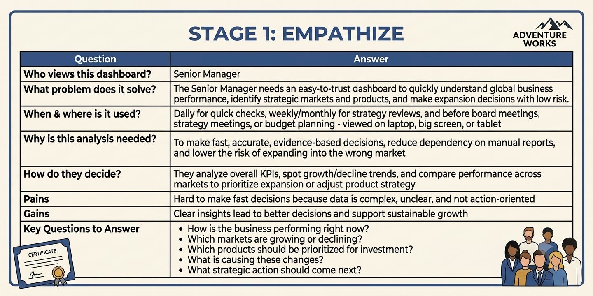
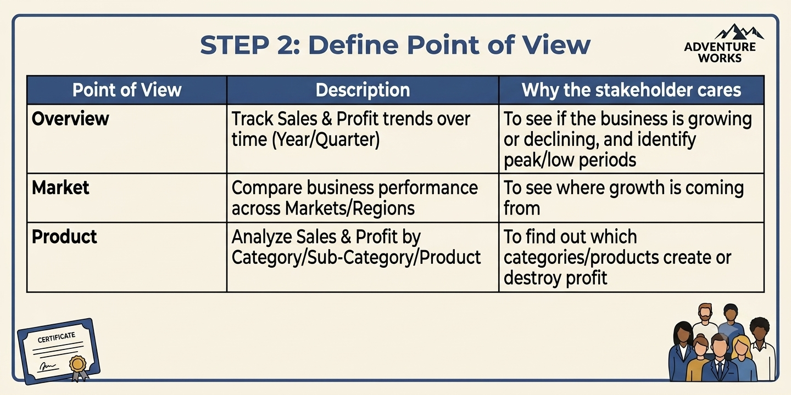
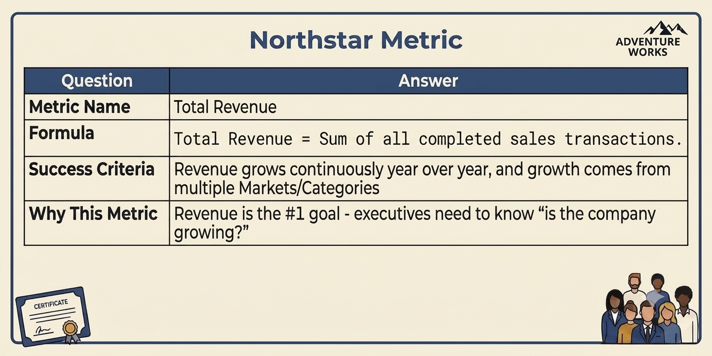
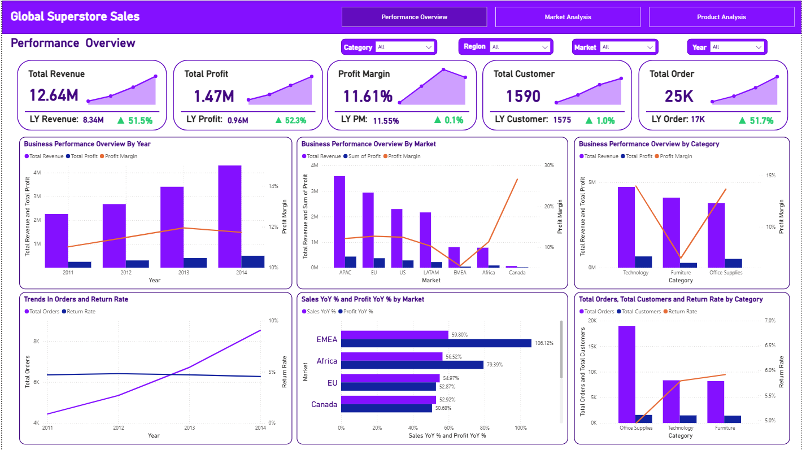
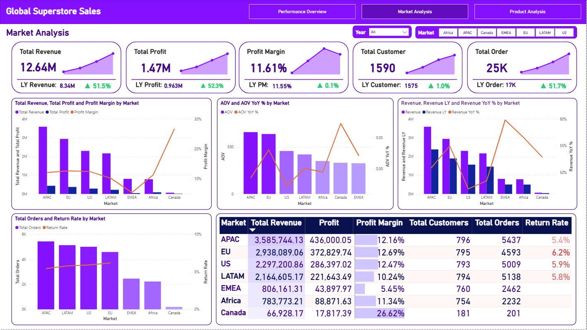
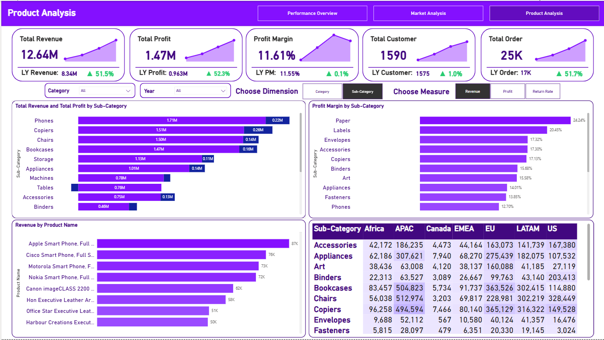

# 📊 Power BI | Global Superstore Sales Performance Dashboard 

  

_Help a Senior Manager understand the overall business performance, compare markets, and identify which products to grow or cut - all in one interactive dashboard._

- 🎯 **Business Question:** What is the overall business performance, how are different markets doing, and which products should the company focus on?
- 🏬 **Domain:** Global Retail / E-commerce 
- 🛠️ **Tools:** Power BI

👤 Author: Bạch Minh Nam

---

## 📑 Table of Contents
1. [📌 Background & Overview](#-background--overview)
2. [📂 Dataset Description & Data Structure](#-dataset-description--data-structure)
3. [🧠 Design Thinking Process](#-design-thinking-process)
4. [📊 Key Insights & Visualizations](#-key-insights--visualizations)
5. [🔎 Final Conclusion & Recommendations](#-final-conclusion--recommendations)

---

## 📌 Background & Overview

### 🎯 Business Problem

Global Superstore is a company that sells products in many markets across different continents. The company is growing fast and wants to expand into more markets to gain market share.

The Senior Manager needs a dashboard to answer 3 main questions:

✔️ **Overall Performance:** How is the business doing right now? Is revenue and profit growing?

✔️ **Market Performance:** Which markets are performing well, and which ones need attention?

✔️ **Product Performance:** Which product categories are profitable, and which ones should be prioritized or cut?

This project uses Power BI to turn raw sales data into a dashboard that helps the Senior Manager make faster, data-driven decisions about where to expand and which products to invest in.

### 👤 Who is this project for?

✔️ Senior Managers & Business Directors - to get a quick, reliable view of company performance

✔️ Sales & Market teams - to compare performance across regions and plan strategy

✔️ Product teams - to identify which categories or products drive (or hurt) profit

---

## 📂 Dataset Description & Data Structure

### 📌 Data Source
- Source: Global Superstore Sales dataset (loaded via Google BigQuery)
- Format: Live connection / Power Query

### 📊 Data Structure & Relationships

#### 1️⃣ Data Structure

The dataset has **3 tables**:

<b>📋Table 1: Orders</b> - Main fact table storing all sales transaction details

  
| Column Name | Description |
|---|---|
| `Order ID` | Unique ID for each order |
| `Order Date` | Date the order was placed |
| `Ship Date` | Date the order was shipped |
| `Ship Mode` | Shipping method |
| `Customer ID` | Unique ID for each customer |
| `Customer Name` | Name of the customer |
| `Segment` | Customer segment |
| `City` | City of the customer |
| `State` | State/Province of the customer |
| `Country` | Country of the customer |
| `Postal Code` | Postal code of the customer's location |
| `Market` | Market region |
| `Region` | Sub-region within a market |
| `Product ID` | Unique ID for each product |
| `Category` | High-level product category |
| `Sub-Category` | More specific product grouping under a category |
| `Product Name` | Name of the product |
| `Sales` | Total sales value of the order line |
| `Quantity` | Number of units ordered |
| `Discount` | Discount rate applied to the order |
| `Profit` | Profit earned from the order |
| `Shipping Cost` | Cost to ship the order |
| `Order Priority` | Priority level of the order |
 

<b>👤 Table 2: People</b> - Stores salesperson and regional assignments

  
| Column Name | Description |
|---|---|
| `Person` | Name of the salesperson |
| `Region` | Region this person is responsible for |
 

<b>↩️ Table 3: Returns</b> - Records product returns by order

  
| Column Name | Description |
|---|---|
| `Order ID` | Order that was returned |
| `Returned` | Yes/No flag indicating if order was returned |
 

#### 2️⃣ Data Relationships

The 3 tables are connected as follows:

- `People` → `Orders`: One person manages many orders (1-to-many, joined on `Region`)
- `Orders` → `Returns`: One order can have one return record (joined on `Order ID`)

  

---

## 🧠 Design Thinking Process

This project followed the Design Thinking framework across 2 main steps: Empathize and Define Point of View

### 1️⃣ Empathize - Understanding the Stakeholder

  

### 2️⃣ Define Point of View - Choosing the Right Angles

  

### **⭐ Northstar Metrics:**

  

> 📄 For the full Design Thinking breakdown, see [Global Superstore Sales Design Thinking ](Design_Thinking_Global_Superstore_Sales.pdf)

---

## 📊 Key Insights & Visualizations

### 🔍 Dashboard Preview

#### 1️⃣ Page 1 - Performance Overview

  

📌 **Analysis 1:** -- insight - 4 cái

- **Observation:** Overall, the business is growing well - both Revenue and Profit went up more than 50% compared to last year, and Profit Margin stayed stable at around 11.6%. But there's one concern: the Return Rate has been going up every year since 2012, while Total Orders also keep increasing. This means a bigger portion of orders are being returned over time, which could slowly reduce profit if nothing is done. Also, when looking by category, Furniture has decent revenue but a much lower profit margin compared to Technology.

- **Recommendation:** -- để cuối
  - 🔴 **Check the return rate problem first.** Look into which markets or categories have the most returns, and find out why (bad product quality, wrong sizing, slow delivery, etc.).
  - 🟡 **Review Furniture's profit margin.** Compare it with Technology to understand why it's lower - maybe it's discounts, shipping cost, or pricing.
  - 🟢 **Learn from 2013.** That year had the best profit margin, so it's worth checking what was different that year and try to repeat it.

#### 2️⃣ Page 2 - Market Analysis

  

📌 **Analysis 2:**

- **Observation:** APAC and EU bring in the most revenue, which is expected since they're the biggest markets. But Canada - even though it's the smallest market - has the highest profit margin (26.62%). On the other hand, EMEA has the lowest profit margin and the highest return rate (6.2%) among the bigger markets. EMEA's AOV (average order value) also goes up and down a lot from year to year, which shows its performance isn't very stable yet.

- **Recommendation:**
  - 🔴 **Don't expand EMEA yet.** Its low margin and high return rate suggest there are issues to fix first - expanding now would just make those issues bigger.
  - 🟡 **Study what makes Canada so profitable.** Even though it's small, its model (pricing, products sold, etc.) might work well for similar smaller markets like Africa or LATAM.
  - 🟢 **Keep investing in APAC and EU**, since they are the main markets driving the company's revenue and profit.

#### 3️⃣ Page 3 - Product Analysis

  

📌 **Analysis 3:** -- keyfinding

- **Observation:** Tables has good revenue (~0.76M), but it actually has a negative profit - meaning the company is losing money on this product. On the other side, Paper and Labels don't show up in the top revenue list, but they have the highest profit margins (24.24% and 20.45%). These products are profitable but not getting much attention. Also, the table shows that APAC and EU make up most of the sales for almost every product category.

- **Recommendation:** 
  - 🔴 **Review pricing and cost for Tables.** A product that's losing money needs urgent attention - check if it's because of high discounts, high shipping cost, or low selling price.
  - 🟡 **Promote Paper and Labels more.** These products are very profitable but don't sell as much - giving them more marketing or better placement could help increase overall profit.
  - 🟢 **Try selling high-margin products (like Paper, Labels) in weaker markets** like EMEA or Africa to see if it helps improve their numbers too.

---

## 🔎 Final Conclusion & Recommendations

📍 Key Takeaways:

✔️ **Best expansion candidates: Canada & LATAM.** Canada has the highest profit margin (26.62%) but is currently the smallest market - this means there's a lot of room to grow without hurting efficiency. LATAM is the second-best pick: it has solid Revenue growth and a more stable AOV compared to EMEA or Africa. These two markets give the best balance of "low risk + good return" for expansion.

✔️ **Recommended product-market pairing for expansion.** When entering or growing in Canada and LATAM, prioritize high-margin sub-categories like Paper and Labels instead of pushing the same products as APAC/EU. Pairing an efficient market with efficient products gives the best chance of strong margins from day one.

✔️ **Fix EMEA before expanding it further.** EMEA has the lowest profit margin and highest return rate among major markets, with unstable AOV year to year. Expanding here now would just scale up existing problems - it needs an operational fix first, not more investment.

✔️ **Watch the return rate before it affects future growth.** The return rate has been rising every year since 2012. If this isn't addressed, it could slow down profit growth even if revenue keeps increasing - especially as the company expands into new markets.

✔️ **Clean up the product portfolio before scaling.** Tables is currently losing money and should not be part of any expansion plan until its pricing/cost issue is fixed. Meanwhile, Paper and Labels are underused high-margin products that should be the face of any new market push.
